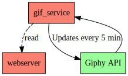

# simple-page

## About

Nothing really useful. Just me learining about [gotham](https://gotham.rs/),
[hyper](https://hyper.rs/), [tokio](https://tokio.rs/) and Async programming in Rust in general.
I'm pretty new to [Futures](https://blog.rust-lang.org/2019/07/04/Rust-1.36.0.html#the-future-is-here)
but it's super interesting.

Watch [this video](https://www.youtube.com/watch?v=j0SIcN-Y-LA) to understand how it all works.

## Idea

I just want to have a **very simple static HTML** that renders some random gifs from giphy. I would
like to update those gifs every 5 minutes and just store them in memory for each request.



## Requirements

- Rust >= 1.36

## How to run

```
ADDRESS=127.0.0.1:7879 cargo run
```

1. Start webserver

```
cargo run --bin webserver
```

## How to run (nested iframes)

1. Start iframe service

```
ADDRESS=127.0.0.1:7880 cargo run
```

1. Start intermediate iframe service

```
ADDRESS=127.0.0.1:7879 IFRAME_ADDRESS=http://127.0.0.1:7880/page?title=baz cargo run
```

1. Start main webserver

```
ADDRESS=127.0.0.1:7878 IFRAME_ADDRESS=http://127.0.0.1:7879/page_with_iframe?title=bar cargo run
```

1. Access with browser in
   [http://127.0.0.1:7878/page_with_iframe?title=foo](http://127.0.0.1:7878/page_with_iframe?title=foo)
